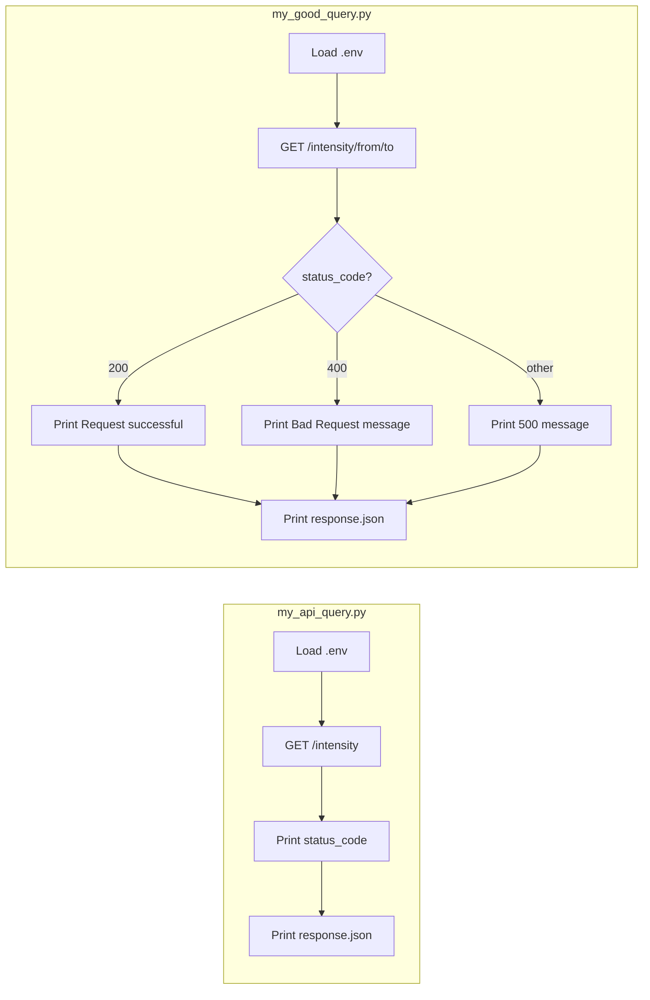
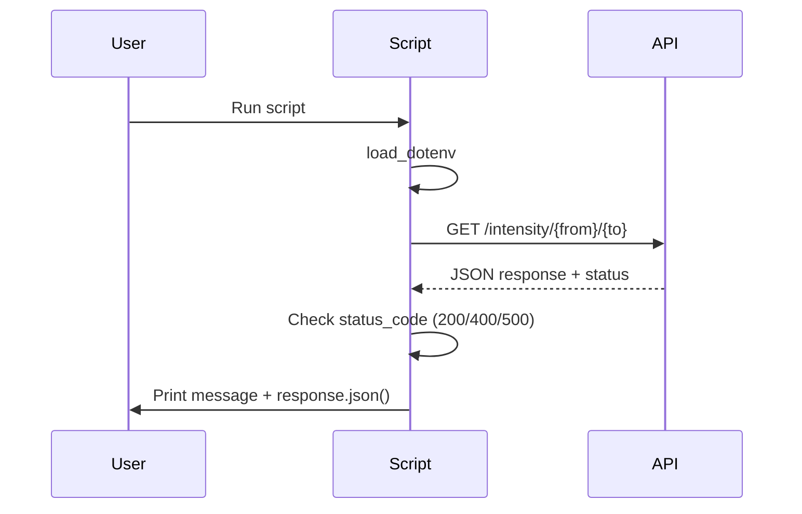

# My API Query Scripts

Documentation for the custom API query scripts in this folder: [`my_api_query.py`](my_api_query.py) and [`my_good_query.py`](my_good_query.py). Both use the **UK Carbon Intensity API** (no API key required).

---

## Table of Contents

- [Overview](#overview)
- [API Endpoints and Parameters](#api-endpoints-and-parameters)
- [Data Structure](#data-structure)
- [Flow Diagram](#flow-diagram)
- [Usage Instructions](#usage-instructions)

---

## Overview

| Script | Purpose | Records returned |
|--------|---------|------------------|
| [`my_api_query.py`](my_api_query.py) | Fetches **current** carbon intensity for Great Britain. | 1 (current half-hour) |
| [`my_good_query.py`](my_good_query.py) | Fetches **time-series** carbon intensity for a date range (e.g. 2017-09-18 to 2017-09-20). | Many (30-minute intervals; 100+ rows typical) |

- **API**: [Carbon Intensity API (UK)](https://api.carbonintensity.org.uk/)
- **Authentication**: None required.
- **Dependencies**: `requests`, `python-dotenv` (optional; used for `.env` in `my_api_query.py`).

---

## API Endpoints and Parameters

### 1. Current intensity — used by `my_api_query.py`

| Item | Value |
|------|--------|
| **Method** | `GET` |
| **URL** | `https://api.carbonintensity.org.uk/intensity` |
| **Path parameters** | None |
| **Query parameters** | None |
| **Response** | Single object: current 30-minute period with `from`, `to`, `intensity`. |

### 2. Intensity date range — used by `my_good_query.py`

| Item | Value |
|------|--------|
| **Method** | `GET` |
| **URL** | `https://api.carbonintensity.org.uk/intensity/{from}/{to}` |
| **Path parameters** | `from`, `to` — ISO 8601 datetimes: `YYYY-MM-DDThh:mmZ` (e.g. `2017-09-18T11:30Z`, `2017-09-20T12:00Z`) |
| **Query parameters** | None |
| **Response** | Array of 30-minute intensity periods between `from` and `to`. |

**Common HTTP responses**

- `200` — Success.
- `400` — Bad request (invalid or missing `from`/`to`).
- `500` — Server error.

---

## Data Structure

### Response wrapper

Both endpoints return JSON with a top-level key:

- **Current**: `data` is a **single object**.
- **Date range**: `data` is an **array of objects**.

### Single period (one 30-minute interval)

```json
{
  "from": "2017-09-18T11:30Z",
  "to": "2017-09-18T12:00Z",
  "intensity": {
    "forecast": 272,
    "actual": 294,
    "index": "moderate"
  }
}
```

| Field | Type | Description |
|-------|------|-------------|
| `from` | string (ISO 8601) | Start of the 30-minute period. |
| `to` | string (ISO 8601) | End of the 30-minute period. |
| `intensity.forecast` | integer | Forecasted carbon intensity (gCO₂/kWh). |
| `intensity.actual` | integer | Actual carbon intensity (gCO₂/kWh). |
| `intensity.index` | string | Category: `"low"`, `"moderate"`, or `"high"`. |

### Date-range response (multiple periods)

```json
{
  "data": [
    { "from": "2017-09-18T11:00Z", "to": "2017-09-18T11:30Z", "intensity": { "forecast": 269, "actual": 299, "index": "moderate" } },
    { "from": "2017-09-18T11:30Z", "to": "2017-09-18T12:00Z", "intensity": { "forecast": 272, "actual": 294, "index": "moderate" } }
  ]
}
```

- Each element has the same shape as the single-period object above.
- Intervals are contiguous 30-minute slots; count depends on the requested range (e.g. ~100 rows for ~2 days).

---

## Flow Diagram

End-to-end flow for both scripts (load env → request → check status → output):



High-level sequence for a single request (e.g. `my_good_query.py`):



---

## Usage Instructions

### Prerequisites

1. **Python 3** with `requests` (and `python-dotenv` if you use `.env`):

   ```bash
   pip install requests python-dotenv
   ```

2. **Optional**: In this folder, create a `.env` file if you use `TEST_API_KEY` in `my_api_query.py` (the Carbon Intensity API does not require a key):

   ```
   TEST_API_KEY=your_key_here
   ```

### Run current intensity (`my_api_query.py`)

```bash
cd 01_query_api
python my_api_query.py
```

- Sends `GET https://api.carbonintensity.org.uk/intensity`.
- Prints HTTP status code and full JSON (one current period).

### Run time-series intensity (`my_good_query.py`)

```bash
cd 01_query_api
python my_good_query.py
```

- Sends `GET https://api.carbonintensity.org.uk/intensity/2017-09-18T11:30Z/2017-09-20T12:00Z`.
- Prints a status message (success / 400 / 500) and full JSON (many 30-minute periods).

To use a different range, edit the URL in the script: replace the two ISO 8601 datetimes in the path with your desired `from` and `to` (format `YYYY-MM-DDThh:mmZ`).

---


---

← 🏠 [Back to Top](#my-api-query-scripts)
