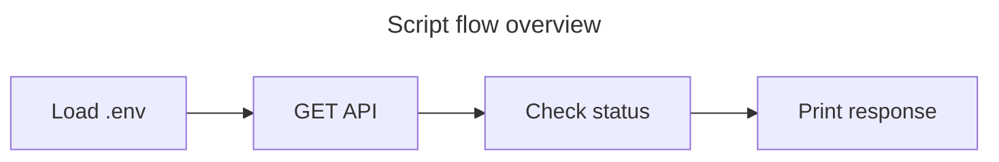

# **<u>My API Query Scripts — Summary</u>**

A short, readable summary of the API query scripts in this folder. For full detail (tables, JSON examples, step-by-step flows), see [README_my_scripts.md](README_my_scripts.md).

---

## **<u>Table of Contents</u>**

- [What This Folder Does](#what-this-folder-does)
- [The Two Scripts at a Glance](#the-two-scripts-at-a-glance)
- [API Basics](#api-basics)
- [Endpoints in Brief](#endpoints-in-brief)
- [What the API Returns](#what-the-api-returns)
- [How the Scripts Behave](#how-the-scripts-behave)
- [How to Run Them](#how-to-run-them)
- [Quick Reference](#quick-reference)

---

## **<u>What This Folder Does</u>**

This folder contains two Python scripts that call the **UK Carbon Intensity API** to fetch electricity carbon intensity data for Great Britain. The API is public and does **not** require an API key. The scripts are:

- [**my_api_query.py**](my_api_query.py) — fetches the **current** 30-minute carbon intensity (one record).
- [**my_good_query.py**](my_good_query.py) — fetches a **time series** of carbon intensity over a date range (many 30-minute intervals; often 100+ rows).

Both use the same API base: [Carbon Intensity API (UK)](https://api.carbonintensity.org.uk/). Dependencies are `requests` and, optionally, `python-dotenv` if you use a [`.env`](.env) file (e.g. for a test key in [my_api_query.py](my_api_query.py)).

---

## **<u>The Two Scripts at a Glance</u>**

| Script | Purpose | Records returned |
|--------|---------|------------------|
| [my_api_query.py](my_api_query.py) | Current carbon intensity for GB. | **1** (current half-hour). |
| [my_good_query.py](my_good_query.py) | Time-series carbon intensity for a date range (e.g. 2017-09-18 to 2017-09-20). | **Many** (30-minute intervals; 100+ rows typical). |

*Use the first when you only need “right now”; use the second when you need history or a range.*

---

## **<u>API Basics</u>**

- **Base**: [Carbon Intensity API (UK)](https://api.carbonintensity.org.uk/).
- **Authentication**: None.
- **Methods**: `GET` only.
- **Responses**: JSON; success is HTTP `200`. Common errors: `400` (bad request, e.g. invalid dates) and `500` (server error).

---

## **<u>Endpoints in Brief</u>**

**1. Current intensity** — used by [my_api_query.py](my_api_query.py)

- **URL**: `GET https://api.carbonintensity.org.uk/intensity`
- **Parameters**: None.
- **Response**: A single object for the current 30-minute period (`from`, `to`, `intensity`).

**2. Intensity by date range** — used by [my_good_query.py](my_good_query.py)

- **URL**: `GET https://api.carbonintensity.org.uk/intensity/{from}/{to}`
- **Path parameters**: `from` and `to` as ISO 8601 datetimes, e.g. `2017-09-18T11:30Z`, `2017-09-20T12:00Z`.
- **Response**: An array of 30-minute periods between `from` and `to`.

*Full parameter and response details are in [README_my_scripts.md](README_my_scripts.md).*

---

## **<u>What the API Returns</u>**

All responses are wrapped in a top-level structure; the important part is the `data` key. For the **current** endpoint, `data` is a **single object**. For the **date-range** endpoint, `data` is an **array** of objects.

Each period (one 30-minute slot) has:

- **from** / **to** — ISO 8601 strings for the interval.
- **intensity** — an object with:
  - **forecast** — forecasted carbon intensity (gCO₂/kWh), integer.
  - **actual** — actual carbon intensity (gCO₂/kWh), integer.
  - **index** — category: `"low"`, `"moderate"`, or `"high"`.

So you get both a numeric value and a simple low/moderate/high label per period. In a date-range response, periods are contiguous 30-minute slots; the number of rows depends on the range (e.g. about 48 per day).

---

## **<u>How the Scripts Behave</u>**

**[my_api_query.py](my_api_query.py)** loads optional environment (e.g. [`.env`](.env)), sends `GET /intensity`, then prints the HTTP status code and the full JSON. *No date parameters; it always gets “now”.*

**[my_good_query.py](my_good_query.py)** loads optional [`.env`](.env), sends `GET /intensity/{from}/{to}` with fixed dates in the script (e.g. 2017-09-18 to 2017-09-20), then checks `status_code`: on `200` it prints a success message and the JSON; on `400` it prints a bad-request message; otherwise it treats it as a server error (e.g. 500) and prints an appropriate message. In all cases it then prints the response body. *To change the range, you edit the `from` and `to` values in the script (ISO 8601 format: `YYYY-MM-DDThh:mmZ`).*

A high-level flow for both is: load env → send request → check status → print message and response. The full document has flowchart and sequence diagrams; below is a simplified overview.



---

## **<u>How to Run Them</u>**

**Prerequisites**

1. **Python 3** with `requests` (and `python-dotenv` if you use [`.env`](.env)):
   ```bash
   pip install requests python-dotenv
   ```
2. *Optional:* Create a [`.env`](.env) in this folder if [my_api_query.py](my_api_query.py) uses something like `TEST_API_KEY`; the Carbon Intensity API itself does not require a key.

**Run current intensity**

```bash
cd 01_query_api
python my_api_query.py
```

*This calls the current endpoint and prints status plus one period of JSON.*

**Run time-series intensity**

```bash
cd 01_query_api
python my_good_query.py
```

*This calls the date-range endpoint with the dates hard-coded in the script and prints the status message and full JSON (many periods). To use a different range, edit the `from` and `to` in [my_good_query.py](my_good_query.py).*

---

## **<u>Quick Reference</u>**

- **One snapshot (now)**: use [my_api_query.py](my_api_query.py) → `GET /intensity`.
- **Many snapshots (range)**: use [my_good_query.py](my_good_query.py) → `GET /intensity/{from}/{to}`; edit `from`/`to` in the script for other dates.
- **Data**: 30-minute periods; each has `from`, `to`, and `intensity` (forecast, actual, index).
- **Docs**: Full tables, JSON samples, and diagrams are in [README_my_scripts.md](README_my_scripts.md). Project overview and navigation are in the main [README.md](README.md) and [docs/README.md](../docs/README.md).

---


---

← 🏠 [Back to Top](#my-api-query-scripts--summary)
