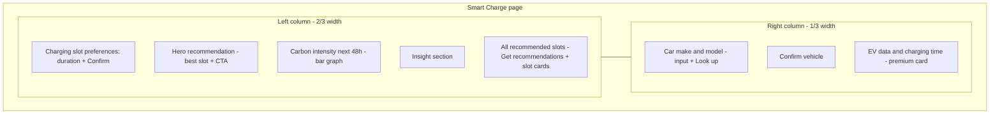

# Smart Charge app — layout diagram

## Page structure (top to bottom)

```
┌─────────────────────────────────────────────────────────────────────────────────┐
│  ev-dashboard (80% width, 10% margin each side)                                  │
├─────────────────────────────────────────────────────────────────────────────────┤
│  APP HEADER                                                                      │
│  [⚡]  Smart Charge                                                              │
│       Best EV charging times from UK carbon intensity                            │
├─────────────────────────────────────────────────────────────────────────────────┤
│  row (two columns: col-md-8  |  col-md-4)                                        │
│  ┌──────────────────────────────────────────┬─────────────────────────────────┐  │
│  │  LEFT COLUMN (2/3 width)                 │  RIGHT COLUMN (1/3 width)      │  │
│  │                                          │                                 │  │
│  │  ┌─ Charging slot preferences ─────────┐ │  ┌─ Car make and model ───────┐ │  │
│  │  │ Duration (hours) [____4____]         │ │  │ Describe the vehicle       │ │  │
│  │  │ Help text...                        │ │  │ [________________]         │ │  │
│  │  │ [Confirm]                           │ │  │ [Look up]                  │ │  │
│  │  └─────────────────────────────────────┘ │  └────────────────────────────┘ │  │
│  │                                          │                                 │  │
│  │  hero_recommendation_ui (when slots OK)  │  ┌─ Confirm vehicle ──────────┐ │  │
│  │  (Hero card: #1 slot, CTA)               │  │ confirm_ui (make/model +    │ │  │
│  │                                          │  │  [Confirm])                 │ │  │
│  │  ┌─ Carbon intensity (next 48h) ────────┐│  └────────────────────────────┘ │  │
│  │  │ intensity_ui (48h bar strip +        ││                                 │  │
│  │  │  highlight)                          ││  ┌─ EV data and charging time ─┐ │  │
│  │  └─────────────────────────────────────┘ │  │ result_error                │ │  │
│  │                                          │  │ result_ui (premium card)    │ │  │
│  │  insight_ui (why this time)              │  └────────────────────────────┘ │  │
│  │                                          │                                 │  │
│  │  ┌─ All recommended slots ──────────────┐│                                 │  │
│  │  │ [Get recommendations]                 ││                                 │  │
│  │  │ slots_ui (loading / slot cards)      ││                                 │  │
│  │  └─────────────────────────────────────┘ │                                 │  │
│  └──────────────────────────────────────────┴─────────────────────────────────┘  │
└─────────────────────────────────────────────────────────────────────────────────┘
```

## Mermaid layout (left vs right)



## Simplified flow (what the user sees)

| Left (main) | Right (sidebar) |
|-------------|-----------------|
| Charging slot preferences (duration + Confirm) | Car make and model (input + Look up) |
| Hero: best slot + "Charge in this window" | Confirm vehicle (edits + Confirm) |
| Carbon intensity (next 48h) bar graph | EV data and charging time (premium card) |
| Insight (why this time) | |
| All recommended slots (list + Get recommendations) | |

## Data flow (conceptual)

- **Charging time** comes from: (1) left duration input after Confirm, or (2) right vehicle after Confirm. Slots flow uses `max(vehicle_hours, slot_length_hours)` when vehicle is set.
- **Slots** run when: user clicks Confirm (slot hours) or Confirm (vehicle), or Get recommendations.
- **Hero / insight / intensity highlight** use first recommended slot from `slots_result`.
