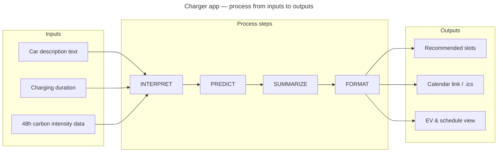

# **<u>Smart Charge App — Project Process</u>**

Needs–goals mapping and a high-level process diagram for the charger app.

---

## **<u>Stakeholder Needs vs System Goals</u>**

| Stakeholder Needs ↓ / System Goals → | Goal 1 INTERPRET | Goal 2 SUMMARIZE | Goal 3 FORMAT | Goal 4 PREDICT | Goal 5 VISUALIZE |
|-------------------------------------|------------------|------------------|---------------|---------------|------------------|
| Need 1: Lowest-carbon charging time | ✔                | ✔                |               | ✔             |                  |
| Need 2: Simple daily schedule        |                  | ✔                | ✔             |               |                  |
| Need 3: Easy understanding of data  | ✔                |                  | ✔             |               |                  |
| Need 4: Future planning              | ✔                |                  |               | ✔             |                  |
| Need 5: Advertise green energy adoption |               | ✔                | ✔             |               | ✔                |

**Short mapping:**

- **Need 1 (Lowest-carbon charging time):** The app **interprets** the user’s car and **summarizes** EV specs; it **predicts** best slots from carbon intensity so the user gets the lowest-carbon charging time.
- **Need 2 (Simple daily schedule):** The app **summarizes** recommended slots and **formats** them into a clear schedule (times, calendar link, .ics) for daily use.
- **Need 3 (Easy understanding of data):** **Interpretation** turns raw intensity and car text into meaning; **formatting** presents times and slots in readable, UK-local form.
- **Need 4 (Future planning):** **Interpretation** of 48h intensity and **prediction** of best windows support planning when to charge in the next 1–2 days.
- **Need 5 (Advertise green energy adoption):** **Summarizing** and **formatting** slot recommendations and **visualizing** intensity and slots make it easy to share and explain green charging choices.

---

## **<u>Process Diagram</u>**

*Main inputs:* free-text car description, charging duration (hours), and 48h carbon intensity data (from API). *Steps:* INTERPRET → PREDICT → SUMMARIZE → FORMAT. *Outputs:* recommended charging slots (schedule), calendar event (link + .ics), and EV summary card.

**Step roles:**

- **INTERPRET:** Derive make/model from car description (Ollama); interpret intensity data (low/medium/high windows).
- **PREDICT:** Choose best charging windows from 48h intensity and duration (OpenAI + intensity API).
- **SUMMARIZE:** Produce EV specs (battery, charge power, charging time) and a short list of recommended slots.
- **FORMAT:** Present times in UK local time; build calendar link and .ics for a simple daily schedule.
