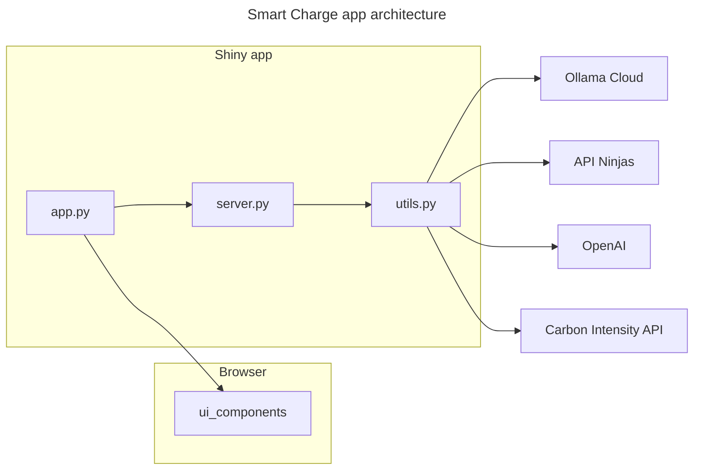
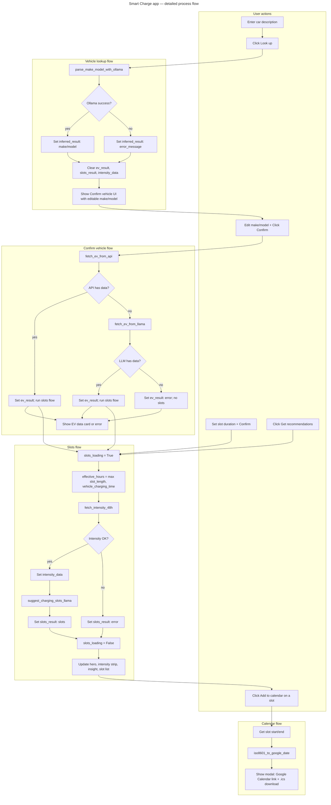

# **<u>Smart Charge — EV Charger App</u>**

A **Shiny (Python)** web app that suggests the best EV charging times using UK carbon intensity data. Describe your car, confirm make/model, then get recommended low-carbon charging windows and add them to your calendar.

---

## **<u>Table of Contents</u>**

**For users**
- [What it does](#what-it-does)
- [Prerequisites](#prerequisites)
- [Installation](#installation)
- [Running the app](#running-the-app)
- [Configuration](#configuration)
- [Using the app](#using-the-app)

**For developers**
- [Architecture overview](#architecture-overview)
- [Process flow (detailed)](#process-flow-detailed)
- [Project structure](#project-structure)
- [Server flow](#server-flow)
- [Backend services](#backend-services)
- [Layout and UI](#layout-and-ui)

---

## **<u>What it does</u>**

- **Vehicle lookup:** Describe your EV in plain text (e.g. *“Tesla Model 3 Long Range”*). The app uses an AI service to infer make and model, then you confirm or edit before fetching specs.
- **EV data:** After confirmation, the app fetches battery capacity, charge power, and estimated charging time from an external API (with an AI fallback when the API has no match).
- **Best charging slots:** Set your preferred charging duration and click **Get recommendations**. The app uses UK carbon intensity (next 48 hours) and an AI to suggest low-carbon time windows.
- **Calendar:** Add a recommended slot to your calendar (Google Calendar or download `.ics`) so you can charge in the suggested window.

*All times are shown in UK local time; carbon data is from the National Grid ESO.*

---

## **<u>Prerequisites</u>**

- **Python 3.10+**
- **API keys** (see [Configuration](#configuration)): Ollama Cloud, API Ninjas (EV data), and OpenAI (for slot recommendations).

---

## **<u>Installation</u>**

1. From the [charger_app](.) directory, create a virtual environment and install dependencies:

   ```bash
   python -m venv .venv
   .venv\Scripts\activate   # Windows
   # source .venv/bin/activate   # macOS/Linux
   pip install -r requirements.txt
   ```

2. Add a [`.env`](.env) file (or use the repo root [`.env`](../.env)) with the required keys. *See [Configuration](#configuration).*

---

## **<u>Running the app</u>**

From the [charger_app](.) directory with the virtual environment active:

```bash
python app.py
```

*Or:* `shiny run app.py`. The app opens in your default browser (e.g. http://127.0.0.1:8000).

---

## **<u>Configuration</u>**

The app reads environment variables from a [`.env`](.env) file in this directory or from the repository root. Create one with:

| Variable | Purpose |
|----------|---------|
| `OLLAMA_API_KEY` | Ollama Cloud — used to extract make/model from your car description and for slot suggestions (model: gpt-oss:20b-cloud). |
| `EV_API_KEY` | API Ninjas — used to fetch EV specs (battery, charge power) by make/model. |
| `OPENAI_API_KEY` | OpenAI — used for *best charging slots* recommendations (model: gpt-4o-mini). |

*If `EV_API_KEY` is missing or the API returns no vehicle, the app can fall back to an LLM to infer specs; slot recommendations still require `OPENAI_API_KEY` and carbon intensity data.*

---

## **<u>Using the app</u>**

1. **Left column:** Set **Charging slot preferences** (duration in hours) and click **Confirm**.
2. **Right column:** In **Car make and model**, describe your vehicle and click **Look up**. Review/correct the suggested make and model, then click **Confirm**.
3. **EV data and charging time** appears after confirmation; **Carbon intensity (next 48h)** and the **Hero** recommendation update when slots are available.
4. Click **Get recommendations** in **All recommended slots** to refresh suggested windows. Use **Add to calendar** on a slot to open Google Calendar or download an `.ics` file.

*The hero card highlights the single best slot; the list shows all recommended slots with intensity level (low/medium/high).*

---

## **<u>Architecture overview</u>**

The app is a single-page Shiny app: UI and theme are defined in one module, server logic in another, and all external calls (Ollama, EV API, OpenAI, carbon intensity API) live in a utils module.



---

## **<u>Process flow (detailed)</u>**

End-to-end process from user actions to UI updates. *Diamonds are decisions; rectangles are steps or stored state.*



**Triggers for slots flow:** Confirm vehicle (after API or LLM returns EV data), Confirm slot hours (left column), or Get recommendations. *Each run uses current slot length and vehicle charging time to compute effective hours, then fetches fresh 48h intensity and calls the LLM for slot suggestions.*

---

## **<u>Project structure</u>**

| File | Role |
|------|------|
| [app.py](app.py) | Entry point: wires [app_ui](ui_components.py) and [server](server.py), runs the Shiny app. |
| [server.py](server.py) | All reactive logic: Look up / Confirm vehicle, fetch EV data, run slots flow, intensity timeline, calendar modal. |
| [ui_components.py](ui_components.py) | Layout, inputs, and [CUSTOM_CSS](ui_components.py): dashboard, cards, hero, intensity strip, slot cards, calendar modal. |
| [utils.py](utils.py) | API and AI helpers: Ollama (make/model, slot suggestions), API Ninjas (EV data), OpenAI (slots), carbon intensity, charging time, date/ISO8601 formatting. |
| [requirements.txt](requirements.txt) | Dependencies: `shiny`, `pandas`, `requests`, `python-dotenv`. |
| [LAYOUT_DIAGRAM.md](LAYOUT_DIAGRAM.md) | ASCII and Mermaid layout diagrams and data-flow notes. |

*No database or React; state is held in reactive values in [server.py](server.py).*

---

## **<u>Server flow</u>**

1. **Look up:** User text → `parse_make_model_with_ollama()` in [utils.py](utils.py) → `inferred_result` (make/model or error). Confirm UI and editable make/model are shown.
2. **Confirm vehicle:** Edited make/model → `fetch_ev_from_api()`; if no data, `fetch_ev_from_llama()` fallback. Result stored in `ev_result`. On success, slots flow is triggered.
3. **Slots flow:** Effective charging hours = max(slot length, vehicle charging time). Fetches 48h intensity via `fetch_intensity_48h()`, then `suggest_charging_slots_llama()` (OpenAI) → `slots_result` and `intensity_data`. Hero, intensity strip, insight, and slot list all react to these.
4. **Get recommendations:** Re-runs the same slots flow (intensity + LLM) so the user can refresh slots without changing vehicle.
5. **Add to calendar:** Modal with Google Calendar link and `.ics` download; times are converted with [utils](utils.py) helpers (`iso8601_to_google_date`, etc.).

*Reactive values: `inferred_result`, `ev_result`, `slots_result`, `intensity_data`, `slots_loading`. No persistent storage.*

---

## **<u>Backend services</u>**

- **Ollama Cloud** (`https://ollama.com/api/chat`): make/model extraction and (in utils) slot-suggestion prompt; requires `OLLAMA_API_KEY`.
- **API Ninjas** (EV API): vehicle specs by make/model; requires `EV_API_KEY`. See [utils.py](utils.py) `fetch_ev_from_api()`.
- **OpenAI** (Chat Completions): used by `suggest_charging_slots_llama()` in [utils.py](utils.py) to recommend slots from intensity data; requires `OPENAI_API_KEY`.
- **Carbon Intensity API** (National Grid ESO): 48h forecast; no key required. Used in `fetch_intensity_48h()` in [utils.py](utils.py).

*All network calls and timeouts are in [utils.py](utils.py); [server.py](server.py) only calls the exported functions.*

---

## **<u>Layout and UI</u>**

- **Layout:** Two columns (left ~2/3, right ~1/3). Left: charging preferences, hero recommendation, 48h intensity strip, insight, all slots. Right: car input + Look up, Confirm vehicle card, EV data and charging time card. See [LAYOUT_DIAGRAM.md](LAYOUT_DIAGRAM.md).
- **Theming:** [ui_components.py](ui_components.py) defines `CUSTOM_CSS` with CSS variables for light/dark (`prefers-color-scheme`), accent colors, and classes for cards, hero, intensity bars, slot badges, and the calendar modal.
- **Modal:** The “Add charging slot to calendar” dialog is built with Shiny’s `ui.modal_*` in [server.py](server.py) and styled via `.shiny-modal .modal-content` in [CUSTOM_CSS](ui_components.py).

*For a concise UI redesign log, see [UI_REDESIGN.md](UI_REDESIGN.md) if present.*
