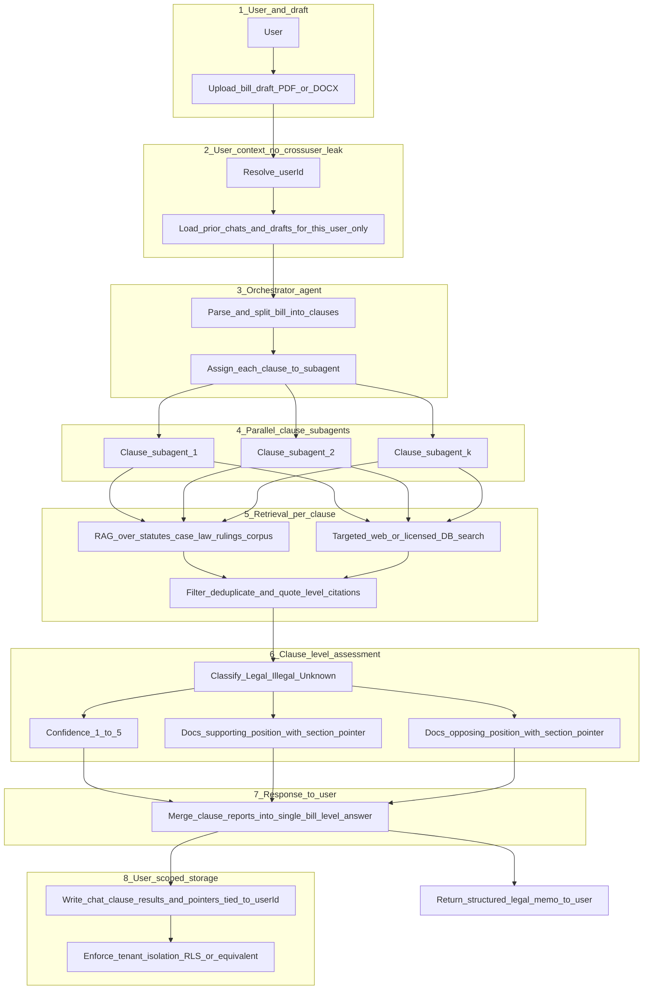

# Legality checker agent: end-to-end bill / clause workflow

User upload → user-scoped context → clause decomposition and sub-agents → RAG and external retrieval → per-clause legal assessment → aggregated response → user-scoped storage (no cross-user draft leakage).

**Retrieval note:** The `Targeted_web_or_licensed_DB_search` node is generic on purpose. In production, public sources (e.g., statutes, Congress.gov) may be open, while paywalled systems (Westlaw, Lexis, PACER) should be accessed through enterprise APIs or allowed connectors, not ad hoc scraping, according to your organization’s policy.
